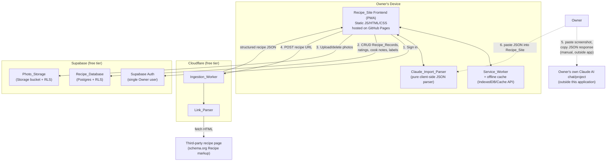
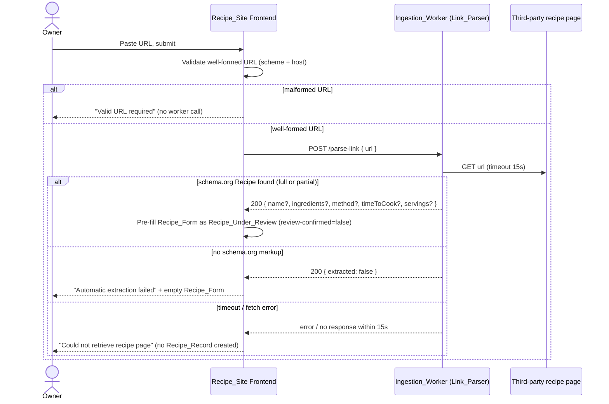

# Design Document

## Overview

The Personal Recipe Website (Recipe_Site) is a single-user, installable web application for collecting, enriching, browsing, and cooking from recipes. It is built entirely on free-tier managed services to keep ongoing cost at zero:

- **GitHub Pages** hosts the static frontend (HTML/CSS/JS bundle, PWA manifest, service worker).
- **Supabase (free tier)** provides Postgres (Recipe_Database), file storage (Photo_Storage), and single-user authentication.
- **Cloudflare Worker (free tier)** acts as the Ingestion_Worker: a serverless proxy that fetches recipe URLs and extracts schema.org Recipe markup (Link_Parser). This is the only server-side component; no third-party paid API or secret key is required anywhere in the system, keeping the application fully free to run.
- **Claude_Import_Parser** is a pure client-side (in-browser) function, not a server component: the Owner uses their own Claude AI chat/project (outside this application, under their own subscription if any) to convert a screenshot or description into a fixed JSON shape, pastes that JSON into the Recipe_Site, and the parser validates/maps it locally with no network call.
- **PWA_Shell** (web app manifest + Service_Worker) makes the site installable and lets previously viewed Recipe_Records remain viewable offline.

This design covers MVP scope only, matching requirements.md. The weekly meal planner is out of scope.

### Key design decisions and rationale

| Decision | Rationale |
|---|---|
| Static frontend + BaaS (Supabase) instead of a custom backend | No server to run means GitHub Pages hosting stays free and there's no server process to keep patched/running for a single-user app. |
| Cloudflare Worker used only for URL fetch | Fetching arbitrary third-party recipe pages needs to bypass browser CORS restrictions, which requires a server-side fetch; everything else (CRUD, filtering, auth) can talk to Supabase directly from the browser under Row Level Security (RLS). |
| Claude AI recipe extraction done via the Owner's own Claude AI chat/project, not a server-side API call | Keeps the application entirely free to run (no Anthropic API billing account needed); the Owner already has full control over Claude AI outside this application, and pasting fixed-format JSON back in is a low-friction, zero-cost substitute for a Screenshot_Parser worker endpoint. |
| Supabase Auth (email/password, single user) instead of a custom auth system | Requirement 18 only needs single-user gating, not multi-tenant auth; Supabase Auth + RLS gives session management, idle expiry, and DB-level enforcement for free. |
| Client-side Postgres access via Supabase JS client + RLS, no custom REST layer | Keeps the frontend static (no server-rendered API) while still enforcing "Owner only" access at the database layer, which is more robust than relying on client-side checks alone. |
| IndexedDB-backed offline cache (via service worker + Cache API/IndexedDB) rather than only HTTP cache | Recipe_Records are JSON data fetched via the Supabase client (not simple static GET requests), so caching full Recipe_Record payloads (including photo blobs) needs an app-level cache, not just the browser HTTP cache. |
| Ingredient merge logic implemented as a pure client-side function | Requirement 14.2's merge rules are the most complex logic in the system; keeping it as a pure function (no I/O) makes it straightforward to test exhaustively with property-based testing. |

## Architecture

### High-level architecture

### Request flow: Add recipe via link (Requirement 1)

### Deployment / hosting model

- Frontend: static bundle pushed to a `gh-pages` branch (or `docs/` folder) and served by GitHub Pages over HTTPS. No server-side rendering.
- Ingestion_Worker: deployed via `wrangler`, bound to Cloudflare's free plan (100,000 requests/day, 10 ms CPU time per invocation on the free plan, up to 50 external subrequests per invocation). Link_Parser fetches external hosts, which count as external subrequests — comfortably within the free-plan subrequest limit for single-user usage.
- Supabase: single free project (paused after 7 days of total inactivity — acceptable for a personal app since any Owner visit resets the inactivity clock; 500 MB Postgres storage, 1 GB file storage, which is generous for recipe text + a modest number of photos).
- Secrets: no third-party paid API key is used anywhere in this system. The Supabase anon/public key is safe to ship to the client (per Supabase's design) because all data access is enforced by RLS policies scoped to the Owner's user id. The Ingestion_Worker holds no secrets at all in this design (it only fetches public recipe pages), though the Supabase JWT verification described below still gates who may call it.

## Components and Interfaces

### Frontend (Recipe_Site)

Responsibilities:
- Renders Recipe_Form, recipe list/grid, recipe detail, shopping list builder, and pantry exclusion list management UI.
- Validates all bounded fields client-side before submission (Requirements 3.4, 8.1, 9.1, 11.1-11.3, 13.4, 14.3, 15.4) as a first line of defense; Supabase-side constraints (check constraints / RLS) act as the second line of defense.
- Owns the Recipe_Under_Review state machine (Requirement 4): holds pre-filled or manually entered data in memory/local component state until the Owner confirms, at which point it calls the Recipe_Database to create a Recipe_Record.
- Calls the Ingestion_Worker for link ingestion; calls Supabase directly (via `@supabase/supabase-js`) for auth, CRUD, and storage.
- Implements the pure, side-effect-free `mergeIngredients`, `filterByBudget`, `filterByCategories`, `searchByIngredient`, `applyPantryExclusion`, `computeProteinPerCalorieRatio`, and `Claude_Import_Parser` functions used across Requirements 2, 8, 10, 12, 13, 14, 15.
- Displays a fixed, copyable prompt/format template (Requirement 2.1) instructing the Owner how to convert a screenshot or description into the documented JSON shape using their own Claude AI chat/project, entirely outside this application.
- Registers the Service_Worker and manages the offline cache of viewed Recipe_Records.

### Ingestion_Worker (Cloudflare Worker)

Exposes a single endpoint, requiring the Owner's Supabase JWT (passed as `Authorization: Bearer <token>`) so the worker only serves the authenticated Owner. The endpoint is stateless (no data is persisted by the worker itself) and holds no third-party secrets.

#### Link_Parser

- `POST /parse-link`
- Request: `{ "url": string }` (frontend has already validated well-formedness before sending — Requirement 1.1).
- Behavior: fetches the URL with a 15-second timeout (Requirement 1.6), parses the response HTML for `schema.org/Recipe` JSON-LD or Microdata, and maps found fields to `{ name, ingredients[], method, timeToCookMinutes, servings }`. Fields not found are omitted (not defaulted to empty string) so the frontend can distinguish "not extracted" from "extracted as empty" (Requirement 1.4).
- Response: `200 { extracted: true, fields: {...present fields...} }`, `200 { extracted: false }` (no markup found), or a `4xx/5xx`/timeout for fetch failures.

### Claude_Import_Parser (client-side only, no server component)

- A pure function `parseClaudeImportJson(pastedText: string): { extracted: true, fields: {...} } | { extracted: false }` that runs entirely in the browser.
- Behavior: attempts `JSON.parse` on the pasted text, then validates the parsed value against the documented shape `{ name?, sourceLink?, ingredients?: [{name, quantity, unit}], method?, timeToCookMinutes?, servings? }`. Fields present and correctly typed are returned; the whole parse is treated as failed (`extracted: false`) if the text isn't valid JSON or doesn't match the shape at all (Requirement 2.4).
- No network request of any kind is made — the pasted text (which may contain the Owner's recipe data) never leaves the browser (Requirement 2.6). This also means there is no rate limit, quota, or cost associated with this import path.
- The Recipe_Site's UI displays the exact prompt/schema the Owner should paste into their own Claude AI chat/project (Requirement 2.1), keeping the expected format in sync with what this parser accepts.

### Supabase Recipe_Database

- Postgres tables (see Data Models) with Row Level Security restricting all rows to `auth.uid() = owner_id`, enforcing Requirement 18.1 at the data layer regardless of access path (direct URL, bookmarked link, or raw API request all go through the same RLS-checked Postgres connection).
- Check constraints mirror the bounds in Requirement 3.4, 7.2, 8.1-8.2, 9.1, 10.1-10.2, 11.1-11.3 as a second line of defense beyond client-side validation.

### Supabase Photo_Storage

- A single private Storage bucket (`recipe-photos`), with RLS policies restricting access to the Owner. Each object is keyed by `recipe_id/photo` so re-uploading naturally replaces the previous photo (Requirement 6.1).

### PWA_Shell

- `manifest.json`: name, icons, `start_url`, `display: standalone`, theme colors — enables "Add to Home Screen" / desktop install (Requirement 17.1).
- `service-worker.js`: precaches the static app shell (JS/CSS/HTML/icons) on install (Requirement 17.2) using a cache-first strategy, and exposes a message API the frontend uses to explicitly cache/evict individual Recipe_Records (Requirement 17.3-17.4).

## Data Models

### Recipe_Record

| Field | Type | Bounds / Constraints | Requirement |
|---|---|---|---|
| `id` | UUID | primary key, generated | - |
| `owner_id` | UUID | foreign key to Supabase auth user; RLS key | 18.1 |
| `name` | string | 1-200 characters, required, non-empty after trim | 3.4, 3.2, 3.3, 5.3 |
| `source_link` | string \| null | up to 2048 characters | 3.4, 1.7 |
| `photo_path` | string \| null | Storage object path in Photo_Storage; null = show placeholder | 6.1, 6.5 |
| `ingredients` | array of `{ name: string, quantity: number \| null, unit: string \| null }` | up to 100 lines; each `name` up to 200 characters | 3.4 |
| `method` | string | up to 10,000 characters | 3.4 |
| `time_to_cook_minutes` | integer \| null | 1-1440 | 3.4 |
| `servings` | integer \| null | 1-100 | 3.4 |
| `rating` | integer \| null | 1-5, or null = unrated | 7.1-7.5 |
| `cost_per_portion` | numeric(6,2) \| null | 0.00-9999.99, at most 2 decimal places; null = unset | 8.1-8.4 |
| `cook_notes` | string | up to 5,000 characters; empty string when cleared (never null, so the notes area is always rendered) | 9.1, 9.4 |
| `calories_per_serving` | numeric \| null | >= 0; null = unset | 10.1-10.2 |
| `protein_per_serving` | numeric \| null | >= 0; null = unset | 10.1-10.2 |
| `dietary_labels` | array of string | 0-20 entries; each entry up to 50 characters | 11.1 |
| `key_ingredient_labels` | array of string | 0-20 entries; each entry up to 50 characters | 11.2 |
| `filter_categories` | array of enum | 1 or more entries; each from `{breakfast, lunch, dinner, healthy, quick_and_easy, dinner_party, family, one_pot, budget}` | 11.3-11.5 |
| `created_at` | timestamptz | server-generated | - |
| `updated_at` | timestamptz | server-generated, updated on every edit | - |

Derived (not stored): `protein_per_calorie_ratio = protein_per_serving / calories_per_serving` when both are set and `calories_per_serving > 0`; otherwise "unavailable" (Requirement 10.3-10.5). Computed client-side at render time.

### Recipe_Under_Review

Not a persisted table — an in-memory/client-state shape used while the Owner reviews extracted or manually entered data before it becomes a Recipe_Record:

| Field | Type | Notes |
|---|---|---|
| `fields` | partial `Recipe_Record` (all fields optional except this in-progress state itself) | pre-filled from Link_Parser/Claude_Import_Parser response or blank for manual entry |
| `source` | `"link" \| "claude_import" \| "manual"` | tracks provenance |
| `reviewConfirmed` | boolean | starts `false` (Requirement 4.1); becomes `true` only on explicit Owner confirmation, at which point the Recipe_Record is created (Requirement 4.4) |

### Pantry_Exclusion_List

| Field | Type | Bounds | Requirement |
|---|---|---|---|
| `id` | UUID | primary key | - |
| `owner_id` | UUID | RLS key | 18.1 |
| `entry` | string | 1-100 characters | 15.4 |

Seeded with `salt`, `pepper`, `oil` the first time the Owner's exclusion list is created (Requirement 15.1). Uniqueness enforced case-insensitively and whitespace-trimmed (Requirement 15.5), e.g. via a unique index on `lower(trim(entry))`.

### Shopping list (client-side only, not persisted)

| Field | Type | Notes |
|---|---|---|
| `items` | array of `{ name: string, quantity: number \| null, unit: string \| null, source: "recipe" \| "manual" }` | compiled from selected Recipe_Records' `ingredients`, merged (Requirement 14.2) and pantry-filtered (Requirement 15.2-15.3), plus any manually added items (Requirement 14.3, up to 200 characters each) |

## API / Interface Design

### Frontend ↔ Ingestion_Worker

| Endpoint | Method | Auth | Request | Success Response | Failure Response |
|---|---|---|---|---|---|
| `/parse-link` | POST | `Authorization: Bearer <supabase JWT>` | `{ url: string }` | `200 { extracted: true, fields: {...} }` or `200 { extracted: false }` | `4xx` (bad request/auth), `504`/timeout after 15s (Requirement 1.6) |

The worker validates the JWT against Supabase's JWKS so only the Owner can invoke it, preventing third parties from using the proxy (and burning the free Cloudflare quota) even if they discover the worker URL.

### Frontend ↔ Claude_Import_Parser (no network, in-process only)

| Function | Input | Success Output | Failure Output |
|---|---|---|---|
| `parseClaudeImportJson` | pasted text (string) | `{ extracted: true, fields: {...present fields...} }` | `{ extracted: false }` (invalid JSON or shape mismatch) |

### Frontend ↔ Supabase

- **Auth**: `supabase.auth.signInWithPassword({ email, password })`, `supabase.auth.signOut()`, session persisted in local storage with Supabase's built-in refresh-token rotation; idle-session expiry (Requirement 18.5) is enforced by configuring the Supabase project's refresh token reuse/expiry window and mirrored client-side by a pure `isSessionExpired(lastActivityAt, now)` check that proactively signs the Owner out and shows the sign-in prompt.
- **Data access**: direct table operations through `@supabase/supabase-js` (`select`/`insert`/`update`/`delete` on `recipes` and `pantry_exclusions`), all scoped by RLS to `owner_id = auth.uid()`. No custom REST/GraphQL layer is introduced.
- **Photo storage**: `supabase.storage.from('recipe-photos').upload(path, file, { upsert: true })` for add/replace (Requirement 6.1), `.remove([path])` for deletion (Requirement 5.7), both gated by Storage RLS policies.

## Offline / PWA Caching Strategy

- **App shell caching**: on Service_Worker `install`, precache the static bundle (HTML/CSS/JS/icons/manifest) using a cache-first strategy so the app loads offline (Requirement 17.2).
- **Recipe_Record caching**: whenever the Owner opens a Recipe_Record while online, the frontend serializes that record (including a fetched copy of its photo, if any) and asks the Service_Worker to store it in an IndexedDB-backed offline store (Requirement 17.3). This is an explicit "cache this record" message rather than passive HTTP caching, because Recipe_Record data comes from Supabase's REST/RPC calls rather than a single cacheable URL.
- **Storage-quota failure handling**: the caching write is wrapped so that if the browser's storage quota is exceeded (`QuotaExceededError` or similar), the partially written entry for that record is deleted and previously cached records are left untouched (Requirement 17.4) — implemented as an all-or-nothing transaction per record.
- **Offline viewing**: the frontend checks network status; if offline, it reads only from the offline IndexedDB store. Requesting a record not present there shows "unavailable offline" (Requirement 17.5) rather than attempting (and failing) a network call.
- **Offline write/network actions**: actions requiring network access (add via link, upload photo, sign in) check `navigator.onLine` (and handle failed fetches as an additional signal) before dispatching; if offline, the action is blocked, a notice is shown, and any in-progress form input is left in place in component state rather than cleared or submitted (Requirement 17.6). Note: the Claude AI import path (Requirement 2) needs no network access at all, so pasting Claude-formatted JSON works fully offline.
- **Cache eviction**: no explicit eviction policy is required by the MVP; the offline store grows as the Owner views records. (Left as a possible v2 improvement, not a requirement.)

## Auth Approach

- Single Owner account provisioned once in the Supabase Auth dashboard (email + password); no public sign-up flow is exposed by the frontend.
- All routes/views are gated behind a session check: on load, the frontend calls `supabase.auth.getSession()`; if no valid session exists, only the sign-in form is rendered and no data fetch to `recipes`/`pantry_exclusions`/Storage is issued (Requirement 18.1-18.2).
- Invalid credentials surface Supabase Auth's error response as an inline message; no session is created (Requirement 18.3).
- Sign-out calls `supabase.auth.signOut()`, clearing the local session; subsequent loads re-render the sign-in form (Requirement 18.4).
- Idle timeout (Requirement 18.5) is enforced two ways: (1) Supabase's refresh token expires server-side after the configured inactivity window, so the JWT can no longer be refreshed; (2) the client tracks `lastActivityAt` and proactively signs out and shows the sign-in prompt once 30 idle days have elapsed, so the Owner isn't stuck with a dead session that appears logged-in.
- Defense in depth: even if a client-side check were bypassed, RLS policies on every table and Storage bucket reject any request whose JWT does not belong to the Owner, so unauthenticated or expired requests are denied at the database layer regardless of access path (direct URL, bookmark, or raw API call) — directly satisfying Requirement 18.1's "regardless of the access path used."

## Error Handling

General principle: every failure path leaves existing data unchanged and surfaces a specific, actionable message to the Owner; nothing fails silently.

| Scenario | Handling |
|---|---|
| Malformed URL submitted (1.1) | Rejected client-side before any network call; inline "valid URL required" message. |
| Link_Parser timeout/fetch failure (1.6) | Worker returns error/timeout after 15s; frontend shows "recipe page could not be retrieved" and does not create a Recipe_Record. |
| No schema.org markup found (1.5) | Worker returns `extracted: false`; frontend shows "automatic extraction failed" and opens a blank Recipe_Form. |
| Pasted Claude AI text is not valid JSON or doesn't match the documented shape (2.4) | `parseClaudeImportJson` returns `extracted: false` with no network call; frontend shows "could not parse pasted text" and still offers the Recipe_Form for manual entry. |
| Invalid/out-of-bounds form field (3.5, 7.2, 8.2, 10.2, 11.4-11.5) | Submission rejected client-side (and by DB check constraints as a fallback); offending field(s) identified; all entered values preserved in the form so nothing needs retyping. |
| Recipe_Database update/delete failure (5.4, 5.8) | Frontend leaves the in-memory Recipe_Record unchanged (does not optimistically apply the edit/deletion) and shows "update/deletion failed." |
| Photo upload failure (6.2) | Previously associated photo path is left untouched in the Recipe_Record; "upload failed" shown. |
| Cook notes save failure (9.5) | Previous cook notes value is retained in the form/display; error shown. |
| Duplicate pantry exclusion entry (15.5) | Rejected before insert; "entry already exists" shown; list left unchanged. |
| Clipboard write failure on export (16.4) | "Export failed" shown; the compiled shopping list in memory is untouched so the Owner can retry. |
| Offline cache write exceeds quota (17.4) | Partial entry discarded; previously cached records unaffected; no user-facing error is required by the requirement, but a non-blocking toast may indicate the record wasn't fully cached. |
| Offline attempt to view uncached record (17.5) | "This recipe is unavailable offline" shown instead of a failed network request. |
| Offline attempt at a network-required action (17.6) | Action blocked before any network call; "requires a network connection" shown; in-progress input untouched. |
| Unauthenticated/expired access to any Recipe_Record (18.1-18.2) | RLS denies the query at the database layer; frontend additionally never issues the query without a session and shows the sign-in prompt. |
| Invalid credentials (18.3) | Supabase Auth error surfaced as "invalid credentials"; no session created. |

## Correctness Properties

*A property is a characteristic or behavior that should hold true across all valid executions of a system-essentially, a formal statement about what the system should do. Properties serve as the bridge between human-readable specifications and machine-verifiable correctness guarantees.*

### Property 1: URL well-formedness gating

For any string submitted as a recipe URL, the Recipe_Site accepts it and forwards it to the Link_Parser if and only if the string has both a recognized scheme (`http://` or `https://`) and a non-empty host; otherwise it is rejected without any call to the Link_Parser.

**Validates: Requirements 1.1, 1.2**

### Property 2: Source link preserved on record creation

For any well-formed URL submitted to add a recipe, the resulting Recipe_Record's `source_link` field equals the submitted URL exactly.

**Validates: Requirements 1.7**

### Property 3: Extraction pre-fill only sets returned fields

For any extraction result (from Link_Parser or Claude_Import_Parser) consisting of an arbitrary subset of `{name, ingredients, method, timeToCook, servings}`, pre-filling the Recipe_Form sets exactly the fields present in the result and leaves every other field blank.

**Validates: Requirements 1.3, 1.4, 2.3**

### Property 4: File type/size validation gates photo uploads

For any candidate file with a given MIME type and byte size, the Recipe_Site stores it in Photo_Storage if and only if the MIME type is one of JPEG, PNG, or WEBP and the size is less than or equal to 10 MB; otherwise it is rejected with a reason and never sent.

**Validates: Requirements 6.1, 6.2**

### Property 5: Recipe name is required, everywhere it can be set

For any candidate name string, saving is accepted if and only if the string is non-empty after trimming whitespace; this holds identically at manual creation, at Recipe_Under_Review confirmation, and at edit-time on an existing Recipe_Record.

**Validates: Requirements 3.2, 3.3, 4.5, 5.3**

### Property 6: Rejected submissions preserve all other field values

For any Recipe_Form submission that is rejected (invalid name, or any field out of bounds), every previously entered field value other than the offending one(s) remains present and unchanged in the form afterward.

**Validates: Requirements 3.3, 3.5**

### Property 7: Field bounds validation

For any submitted value for name, source link, an ingredient line, ingredient count, method text, time to cook, or servings, the submission is accepted if and only if the value falls within its documented bounds (name 1-200 chars, source link ≤2048 chars, ingredient line ≤200 chars, ≤100 ingredient lines, method ≤10,000 chars, time to cook integer 1-1440, servings integer 1-100); out-of-bounds values are rejected and identified.

**Validates: Requirements 3.4, 3.5**

### Property 8: Recipe_Under_Review lifecycle

For any sequence of edits applied to a Recipe_Under_Review that never ends in confirmation (including abandonment), no Recipe_Record is created; the Recipe_Under_Review's `reviewConfirmed` flag starts `false` and a Recipe_Record is created if and only if the Owner confirms it with a valid (non-empty) name, at which point `reviewConfirmed` becomes `true`.

**Validates: Requirements 4.1, 4.3, 4.4, 4.6**

### Property 9: Recipe detail view is complete

For any Recipe_Record, the rendered detail view contains the value of every one of its fields (name, source link, photo or placeholder, ingredients, method, time to cook, servings, rating or unrated indicator, cost per portion, cook notes, nutrition, labels).

**Validates: Requirements 5.1**

### Property 10: Edit round trip

For any Recipe_Record and any valid edit to one of its fields, saving the edit and then re-fetching the record yields a record whose edited field equals the new value and whose other fields are unchanged.

**Validates: Requirements 5.2**

### Property 11: Failed persistence leaves data unchanged

For any edit or deletion attempt where the underlying Recipe_Database or Photo_Storage call fails, the Recipe_Record (and its associated photo, for deletions) remains exactly as it was before the attempt, and an error is shown.

**Validates: Requirements 5.4, 5.8**

### Property 12: Confirmed deletion removes record and photo together

For any Recipe_Record, whether or not it has an associated photo, confirming its deletion results in both the Recipe_Record being absent from the Recipe_Database and (if one existed) its photo being absent from Photo_Storage afterward.

**Validates: Requirements 5.6, 5.7**

### Property 13: Photo placeholder invariant

For any Recipe_Record with no associated photo, both the detail view and the browsable list/grid render the defined placeholder image in place of a photo.

**Validates: Requirements 6.5, 12.1**

### Property 14: Rating validation and update

For any current rating (unrated or 1-5) and any submitted value, the resulting rating equals the submitted value if it is an integer between 1 and 5 inclusive or an explicit "clear" action, and otherwise remains equal to the current rating with an invalid-rating indication shown.

**Validates: Requirements 7.1, 7.2, 7.3, 7.4**

### Property 15: Unrated is visually distinct from every rated value

For any rating value (unrated, or an integer 1-5), the rendered representation of "unrated" differs from the rendered representation of every possible 1-to-5 star rating.

**Validates: Requirements 7.5**

### Property 16: Cost per portion validation

For any submitted cost-per-portion value (including an explicit unset/clear), it is accepted if and only if it is unset, or a number between 0 and 9999.99 inclusive with at most two decimal places; otherwise the submission is rejected as invalid.

**Validates: Requirements 8.1, 8.2, 8.3, 8.4**

### Property 17: Budget filter threshold semantics

For any collection of Recipe_Records with arbitrary (including unset) cost-per-portion values and any Owner-specified maximum threshold, the filtered result contains exactly the records whose effective cost (unset treated as zero) is less than or equal to the threshold.

**Validates: Requirements 8.5, 8.6**

### Property 18: Cook notes round trip

For any cook notes string of length 0 to 5,000 characters (including the empty string), saving it and then viewing the Recipe_Record displays exactly that string in the cook notes area, separate from ingredients and method, without deleting the record.

**Validates: Requirements 9.1, 9.2, 9.4**

### Property 19: Failed cook notes save preserves previous value

For any Recipe_Record with existing cook notes and any new notes value whose save operation fails, the displayed cook notes remain equal to the previously saved value, and an error is shown.

**Validates: Requirements 9.5**

### Property 20: Nutrition field non-negativity

For any submitted calories-per-serving or protein-per-serving value, the submission is accepted if and only if the value is zero or greater; negative values are rejected and the field retains its previously saved value.

**Validates: Requirements 10.1, 10.2**

### Property 21: Protein-per-calorie ratio computation

For any combination of calories-per-serving and protein-per-serving (each unset, zero, or a positive number), the displayed protein-per-calorie ratio equals `protein / calories` when both are set and calories is greater than zero, and is "unavailable" in every other case (either field unset, or calories equal to zero).

**Validates: Requirements 10.3, 10.4, 10.5**

### Property 22: Label collection bounds

For any list of Owner-entered dietary labels or key ingredient labels, saving succeeds if and only if the list has at most 20 entries and every entry is at most 50 characters; otherwise the submission is rejected.

**Validates: Requirements 11.1, 11.2**

### Property 23: Filter category validity

For any list of filter categories assigned to a Recipe_Record, saving succeeds if and only if the list is non-empty and every entry belongs to the fixed set `{breakfast, lunch, dinner, healthy, quick and easy, dinner party, family, one-pot, budget}`; otherwise the submission is rejected and the invalid or missing condition is indicated.

**Validates: Requirements 11.3, 11.4, 11.5**

### Property 24: Category filter selects exact matches

For any collection of Recipe_Records and any selected set of filter categories (including the empty set), the displayed results equal exactly the subset of records whose assigned categories are a superset of the selection; an empty selection yields all records, and a selection matching no records yields only a "no matching recipes" message with no records displayed.

**Validates: Requirements 12.3, 12.4, 12.5**

### Property 25: Ingredient search matching semantics

For any collection of Recipe_Records and any search term, the returned results equal exactly the records containing an ingredient whose name has a case-insensitive substring match for the trimmed search term; an empty or whitespace-only term, or a term matching no ingredient, yields only a "no matching recipes" message with no records displayed.

**Validates: Requirements 13.1, 13.2, 13.3**

### Property 26: Search term length bound

For any search term string, the search is rejected with a "maximum length exceeded" indication if and only if its length exceeds 100 characters.

**Validates: Requirements 13.4**

### Property 27: Ingredient merge correctness

For any set of ingredient entries drawn from one or more selected Recipe_Records, the compiled shopping list groups entries whose names are equal after trimming and case-folding into a single line per group; within a group, quantities are summed when every entry in the group shares the same unit, and are listed separately (per original entry) when units differ or any entry in the group lacks a quantity; entries with distinct (post-trim, post-case-fold) names remain on separate lines; and no ingredient entry from a selected recipe is dropped or duplicated by the merge step.

**Validates: Requirements 14.1, 14.2**

### Property 28: Manual shopping list item add/remove round trip

For any compiled shopping list and any manually added item of at most 200 characters, adding it results in a list containing that item, and subsequently removing any item (compiled or manual) present in the list results in a list from which exactly that item is absent and all others are unchanged.

**Validates: Requirements 14.3**

### Property 29: Pantry exclusion filtering

For any ingredient name and any Pantry_Exclusion_List, the ingredient is omitted from the compiled shopping list if and only if its name, trimmed and case-folded, exactly equals some exclusion list entry's name, also trimmed and case-folded.

**Validates: Requirements 15.2, 15.3**

### Property 30: Pantry exclusion list add is duplicate-safe

For any Pantry_Exclusion_List and any candidate entry of at most 100 characters, adding it succeeds and the entry becomes present if and only if no existing entry matches it case-insensitively and whitespace-trimmed; otherwise the list is left unchanged and a duplicate message is shown. Removing an existing entry always results in a list from which exactly that entry is absent.

**Validates: Requirements 15.4, 15.5**

### Property 31: Shopping list export formatting

For any compiled shopping list, exporting it copies to the clipboard a plain-text string whose non-empty lines equal the list's items in the same order, one item per line, if and only if the list is non-empty; if the list is empty, nothing is copied and the Owner is notified there is nothing to export.

**Validates: Requirements 16.1, 16.2, 16.3**

### Property 32: Failed export leaves the shopping list unchanged

For any non-empty compiled shopping list, if the clipboard write fails, the in-memory compiled shopping list is unchanged afterward and an export-failure notice is shown.

**Validates: Requirements 16.4**

### Property 33: Offline record caching is retrievable

For any Recipe_Record (varying in size/content, including its photo), caching it while online followed by an offline read of the same record's id returns a record equal to the one that was cached.

**Validates: Requirements 17.3**

### Property 34: Cache write failure is all-or-nothing

For any set of previously cached Recipe_Records and one additional record whose cache write is forced to fail due to simulated storage exhaustion, every previously cached record remains retrievable unchanged afterward, and the failed record is not present in a partial/incomplete state.

**Validates: Requirements 17.4**

### Property 35: Uncached offline reads are reported as unavailable

For any Recipe_Record id not present in the offline cache, attempting to view it while offline yields an "unavailable offline" indication rather than any record data.

**Validates: Requirements 17.5**

### Property 36: Network-required actions are blocked offline without losing input

For any of the network-requiring actions (add via link, upload photo, sign in) attempted while offline, and any in-progress input value for that action, the action does not reach the network, a "requires a network connection" notice is shown, and the in-progress input value is unchanged afterward.

**Validates: Requirements 17.6**

### Property 37: Idle session expiry boundary

For any elapsed duration since the Owner's last activity, the client-side session is considered expired (requiring re-authentication) if and only if the elapsed duration is 30 days or more.

**Validates: Requirements 18.5**

### Property 38: Claude import parsing is JSON-shape gated and network-free

For any pasted text string, `parseClaudeImportJson` returns `extracted: true` with the matching fields if and only if the text is valid JSON matching the documented shape (or a subset of its optional fields); otherwise it returns `extracted: false`. In neither case is any network request made.

**Validates: Requirements 2.2, 2.4, 2.6**

## Testing Strategy

### Dual testing approach

- **Unit/example tests** cover concrete flows and single-outcome scenarios that don't meaningfully vary with input: worker call wiring (1.2), extraction-failure UI flows (1.5, 1.6, 2.4, 2.5), form-affordance checks (3.1, 4.2), empty-collection/no-selection states (12.2, 14.4), deletion confirmation prompting (5.5), cook notes layout (9.3), Pantry_Exclusion_List default seeding (15.1), PWA manifest/service-worker registration (17.1, 17.2), and Supabase Auth/RLS enforcement (18.1-18.4, integration-tested against a real or emulated Supabase project).
- **Property-based tests** cover the 38 properties above, each implemented as a single property-based test with a minimum of 100 generated iterations, using **fast-check** (the standard property-based testing library for JavaScript/TypeScript, matching the frontend's stack) for all pure client-side logic (validation functions, `mergeIngredients`, `filterByBudget`, `filterByCategories`, `searchByIngredient`, `applyPantryExclusion`, `computeProteinPerCalorieRatio`, `parseClaudeImportJson`, the Recipe_Under_Review state machine, offline cache read/write against a mocked IndexedDB, and the idle-session-expiry boundary check).
- Worker-facing properties (1, 3) are tested against the pure mapping/validation functions with the Link_Parser HTTP call mocked, so iteration cost stays low; a small number of separate integration tests exercise the real Cloudflare Worker against a fixed set of sample recipe pages. `parseClaudeImportJson` (Property 38) requires no mocking at all since it makes no network call.

### Property test configuration

- Library: **fast-check** (`fc.assert(fc.property(...), { numRuns: 100 })` or higher).
- Each test is tagged with a comment referencing its design property, in the format:
  `// Feature: personal-recipe-website, Property {number}: {property title}`
- Each of the 38 properties above is implemented as exactly one property-based test.

### Unit test focus

- Specific extraction-failure and worker-error examples (1.5, 1.6, 2.4).
- UI affordance checks (form fields present, deletion confirmation dialog, cook notes displayed separately, copyable Claude AI prompt/format template shown per Requirement 2.1).
- Default Pantry_Exclusion_List seeding (15.1) and empty-state messaging (12.2, 14.4, 13.2/13.3 edge instances already covered by Property 25 but a couple of concrete examples aid readability).
- Integration tests: Link_Parser against 2-3 real recipe pages with/without schema.org markup; Supabase RLS policies against authenticated vs. unauthenticated/mismatched-user requests (18.1-18.4); Cloudflare Worker JWT verification.
