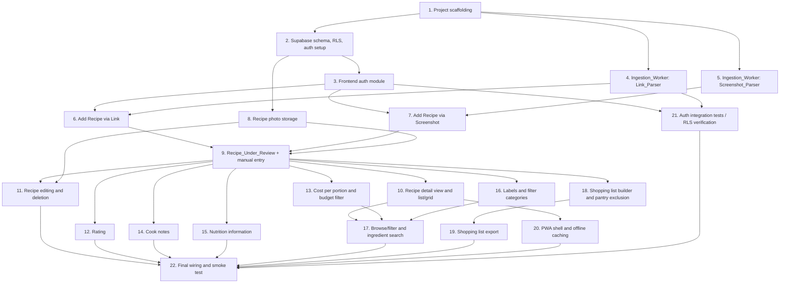

# Implementation Plan

## Overview

This plan implements the Personal Recipe Website per requirements.md and design.md. Tasks are ordered by dependency: project scaffolding → data layer/auth → ingestion → recipe CRUD/review flow → labels/filters/search → shopping list/pantry exclusion → PWA offline. Property-based tests (fast-check, ≥100 runs, tagged `// Feature: personal-recipe-website, Property {N}: {title}`) are embedded next to the code they validate rather than deferred to the end. All 37 correctness properties from design.md are each covered by exactly one property-based test.

## Task Dependency Graph



```json
{
  "waves": [
    { "wave": 1, "tasks": [1] },
    { "wave": 2, "tasks": [2, 4, 5] },
    { "wave": 3, "tasks": [3, 8] },
    { "wave": 4, "tasks": [6, 7] },
    { "wave": 5, "tasks": [9] },
    { "wave": 6, "tasks": [10, 11, 12, 13, 14, 15, 16, 18] },
    { "wave": 7, "tasks": [17, 19, 20, 21] },
    { "wave": 8, "tasks": [22] }
  ]
}
```

## Tasks

- [ ] 1. Project scaffolding
  - [ ] 1.1 Initialize frontend project (Vite + TypeScript), add `@supabase/supabase-js` and `fast-check` (dev dependency) to package.json, configure GitHub Pages deployment (base path, `gh-pages` build output or `docs/` folder) and a GitHub Actions workflow that builds and deploys on push to main.
  - [ ] 1.2 Initialize Cloudflare Worker project (`wrangler init`) for the Ingestion_Worker in a separate `worker/` directory with its own TypeScript config and `wrangler.toml`.
  - [ ] 1.3 Create a Supabase project (or document the manual setup steps if the project must be created via dashboard) and record the project URL/anon key locations expected by the frontend's environment config.
  - _Requirements: (infrastructure, supports all)_

- [ ] 2. Supabase schema, RLS, and auth setup
  - [ ] 2.1 Write SQL migration creating the `recipes` table matching the Recipe_Record data model (id, owner_id, name, source_link, photo_path, ingredients jsonb, method, time_to_cook_minutes, servings, rating, cost_per_portion numeric(6,2), cook_notes, calories_per_serving, protein_per_serving, dietary_labels text[], key_ingredient_labels text[], filter_categories text[], created_at, updated_at) with check constraints mirroring Requirements 3.4, 7.1-7.2, 8.1-8.2, 9.1, 10.1-10.2, 11.1-11.3.
  - [ ] 2.2 Write SQL migration creating the `pantry_exclusions` table (id, owner_id, entry) with a unique index on `lower(trim(entry))` per owner (Requirement 15.5).
  - [ ] 2.3 Write RLS policies on both tables restricting all operations to `owner_id = auth.uid()` (Requirement 18.1).
  - [ ] 2.4 Create the `recipe-photos` Storage bucket with RLS policies scoped to the Owner (Requirement 6.1-6.2, 5.7).
  - [ ] 2.5 Write a migration/seed script that inserts the default Pantry_Exclusion_List entries (`salt`, `pepper`, `oil`) the first time an Owner's exclusion list is created (Requirement 15.1).
  - [ ] 2.6 Write a unit test verifying the seed script inserts exactly `salt`, `pepper`, `oil` and no duplicates on repeated invocation.
  - _Requirements: 3.4, 5.7, 6.1, 6.2, 7.1, 7.2, 8.1, 8.2, 9.1, 10.1, 10.2, 11.1, 11.2, 11.3, 15.1, 15.5, 18.1_

- [ ] 3. Frontend auth module
  - [ ] 3.1 Implement `supabase.auth.signInWithPassword` sign-in form and `signOut` action; gate all app routes behind `supabase.auth.getSession()` so no data fetch occurs without a session (Requirement 18.1, 18.2).
  - [ ] 3.2 Implement inline invalid-credentials error display on failed sign-in (Requirement 18.3).
  - [ ] 3.3 Implement `lastActivityAt` tracking and a pure `isSessionExpired(lastActivityAt, now)` function that triggers sign-out and the sign-in prompt after 30 idle days (Requirement 18.5).
  - [ ] 3.4 Write a property-based test for `isSessionExpired` covering the 30-day boundary (elapsed < 30 days → not expired; elapsed >= 30 days → expired).
    - `// Feature: personal-recipe-website, Property 37: Idle session expiry boundary`
  - [ ] 3.5 Write unit tests: unauthenticated load renders only the sign-in form (18.1/18.2); sign-out clears session and re-renders sign-in form (18.4); invalid credentials show an error and create no session (18.3).
  - _Requirements: 18.1, 18.2, 18.3, 18.4, 18.5_

- [ ] 4. Ingestion_Worker: Link_Parser
  - [ ] 4.1 Implement Supabase JWT verification middleware in the Worker (validate against Supabase JWKS) shared by both endpoints, rejecting requests without a valid Owner token.
  - [ ] 4.2 Implement `POST /parse-link`: fetch the submitted URL with a 15-second timeout, parse schema.org Recipe JSON-LD/Microdata, map to `{ name?, ingredients?, method?, timeToCookMinutes?, servings? }`, returning only fields actually found (Requirement 1.2-1.4, 1.6).
  - [ ] 4.3 Return `{ extracted: false }` when no schema.org Recipe markup is present (Requirement 1.5).
  - [ ] 4.4 Write unit tests for the pure HTML→fields mapping function using fixture HTML: full markup, partial markup (missing fields), and no markup.
  - [ ] 4.5 Write a property-based test for the extraction mapping function: for any subset of `{name, ingredients, method, timeToCook, servings}` present in fixture-generated schema.org markup, the mapped result contains exactly that subset of fields and omits the rest.
    - `// Feature: personal-recipe-website, Property 3: Extraction pre-fill only sets returned fields` (Link_Parser half)
  - [ ] 4.6 Write integration tests against 2-3 real recipe pages (one with full schema.org markup, one with none) to validate the live fetch + parse path.
  - _Requirements: 1.2, 1.3, 1.4, 1.5, 1.6_

- [ ] 5. Ingestion_Worker: Screenshot_Parser
  - [ ] 5.1 Implement `POST /parse-screenshot`: accept multipart form data, re-validate MIME type (JPEG/PNG/WEBP) and size (≤10 MB) server-side as defense in depth (Requirement 2.4), reject with 413 otherwise.
  - [ ] 5.2 Forward valid images to Claude's API using a Worker-held secret (`wrangler secret put`), with a structured-extraction prompt; map Claude's response to the same `{ name?, ingredients?, method?, timeToCookMinutes?, servings? }` shape.
  - [ ] 5.3 Return `{ extracted: false }` when Claude cannot identify recipe structure, and a 502/timeout response when Claude's API is unreachable (Requirement 2.3).
  - [ ] 5.4 Write a unit test confirming the API key is never included in any response payload or echoed back to the client.
  - [ ] 5.5 Write a property-based test for file type/size gating shared with the frontend's photo upload validator (see Task 8): for any (MIME type, byte size) pair, the Worker accepts and forwards to Claude if and only if MIME type is JPEG/PNG/WEBP and size ≤ 10 MB.
    - `// Feature: personal-recipe-website, Property 4: File type/size validation gates ingestion` (Screenshot_Parser half)
  - [ ] 5.6 Write integration tests against 2-3 real screenshots to validate the live Claude round trip.
  - _Requirements: 2.1, 2.2, 2.3, 2.4, 2.6_

- [ ] 6. Frontend: Add Recipe via Link
  - [ ] 6.1 Implement client-side well-formed URL validation (scheme + host) that rejects malformed submissions without calling the worker (Requirement 1.1).
  - [ ] 6.2 Write a property-based test for the URL validator: for any string, it is accepted (and the worker call proceeds) if and only if it has a recognized scheme and non-empty host.
    - `// Feature: personal-recipe-website, Property 1: URL well-formedness gating`
  - [ ] 6.3 Wire "add via link" submission to call `/parse-link` with the Owner's JWT, handling the three response shapes (full/partial extraction, no markup, timeout/fetch error) per the sequence diagram in design.md.
  - [ ] 6.4 On successful (full or partial) extraction, pre-fill the Recipe_Form as a Recipe_Under_Review (see Task 9) with `source: "link"`.
  - [ ] 6.5 Write unit tests for the three failure/success UI flows: no markup found → "automatic extraction failed" + blank form (1.5); timeout/fetch error → error message, no Recipe_Record created (1.6); worker call happens only after client validation passes (1.2).
  - [ ] 6.6 Write a property-based test that for any well-formed URL, the resulting Recipe_Record's `source_link` equals the submitted URL exactly (requires Task 9's create-record function).
    - `// Feature: personal-recipe-website, Property 2: Source link preserved on record creation`
  - _Requirements: 1.1, 1.2, 1.3, 1.4, 1.5, 1.6, 1.7_

- [ ] 7. Frontend: Add Recipe via Screenshot
  - [ ] 7.1 Implement client-side screenshot file validator (JPEG/PNG/WEBP, ≤10 MB) reused from/shared with the photo upload validator in Task 8.
  - [ ] 7.2 Wire "add via screenshot" submission to call `/parse-screenshot` with the validated file and Owner's JWT; on success, pre-fill the Recipe_Form as a Recipe_Under_Review with `source: "screenshot"` and hold the image blob in memory as `screenshotBlob`.
  - [ ] 7.3 On extraction failure or Claude/API unreachable, show "automatic extraction failed" and still open the Recipe_Form for manual entry (Requirement 2.3, 2.5).
  - [ ] 7.4 Write a property-based test for the shared file type/size validator (client-side half of Property 4): for any (MIME type, byte size) pair, the file is sent to the Screenshot_Parser if and only if it's JPEG/PNG/WEBP and ≤10 MB; otherwise rejected client-side with a reason and never sent.
    - `// Feature: personal-recipe-website, Property 4: File type/size validation gates ingestion` (client-side half)
  - [ ] 7.5 Write unit tests for the extraction-failure UI flow (2.3) and for "manual entry always offered regardless of outcome" (2.5).
  - _Requirements: 2.1, 2.2, 2.3, 2.4, 2.5_

- [ ] 8. Frontend: Recipe photo storage
  - [ ] 8.1 Implement photo upload to `supabase.storage.from('recipe-photos').upload(path, file, { upsert: true })`, keyed by `recipe_id/photo` so re-upload replaces the previous photo (Requirement 6.1).
  - [ ] 8.2 Implement upload rejection (wrong format/size, or storage failure) that leaves the previously associated photo untouched and shows an error (Requirement 6.2).
  - [ ] 8.3 Implement the "use screenshot as photo" offer/accept flow: offer shown whenever a screenshot was used for ingestion (6.3), and accepting stores `screenshotBlob` via the same upload path (6.4).
  - [ ] 8.4 Implement placeholder image rendering wherever `photo_path` is null (Requirement 6.5).
  - [ ] 8.5 Write a unit test confirming re-upload of a new photo replaces (not duplicates) the stored object at `recipe_id/photo`.
  - [ ] 8.6 Write a property-based test for Property 13 (photo placeholder invariant): for any Recipe_Record with `photo_path = null`, both detail view and list/grid render the placeholder image.
    - `// Feature: personal-recipe-website, Property 13: Photo placeholder invariant`
  - _Requirements: 6.1, 6.2, 6.3, 6.4, 6.5_

- [ ] 9. Recipe_Under_Review state machine and manual entry
  - [ ] 9.1 Implement the Recipe_Under_Review client-state shape (`fields`, `source`, `reviewConfirmed`, `screenshotBlob`) starting `reviewConfirmed: false` whenever populated from Link_Parser/Screenshot_Parser results or a blank manual-entry form (Requirement 4.1).
  - [ ] 9.2 Implement field editing on a Recipe_Under_Review (name, source link, ingredients, method, time to cook, servings) without creating a Recipe_Record until confirmation (Requirement 4.2, 4.3).
  - [ ] 9.3 Implement field bounds validation shared across manual entry and review confirmation: name 1-200 chars, source link ≤2048 chars, ingredient line ≤200 chars/≤100 lines, method ≤10,000 chars, time to cook integer 1-1440, servings integer 1-100 (Requirement 3.4).
  - [ ] 9.4 Implement rejection behavior for invalid/out-of-bounds submissions that identifies the offending field(s) and preserves all other entered values (Requirement 3.3, 3.5).
  - [ ] 9.5 Implement confirm action: validates non-empty trimmed name, sets `reviewConfirmed = true`, and creates the Recipe_Record via Supabase insert (Requirement 4.4, 4.5); implement abandon action: discards the Recipe_Under_Review without creating a record (Requirement 4.6).
  - [ ] 9.6 Implement manual-entry creation path (no prior extraction): same validation and creation logic, `source: "manual"` (Requirement 3.1, 3.2).
  - [ ] 9.7 Write a property-based test for Property 5 (name required everywhere): for any candidate name string, save succeeds if and only if non-empty after trim — test this identically at manual creation, review confirmation, and edit time (edit time depends on Task 11).
    - `// Feature: personal-recipe-website, Property 5: Recipe name is required, everywhere it can be set`
  - [ ] 9.8 Write a property-based test for Property 6 (rejected submissions preserve other fields): for any rejected submission, all non-offending field values remain unchanged afterward.
    - `// Feature: personal-recipe-website, Property 6: Rejected submissions preserve all other field values`
  - [ ] 9.9 Write a property-based test for Property 7 (field bounds validation): for any value of each bounded field, acceptance holds iff within documented bounds.
    - `// Feature: personal-recipe-website, Property 7: Field bounds validation`
  - [ ] 9.10 Write a property-based test for Property 8 (Recipe_Under_Review lifecycle): for any sequence of edits not ending in confirmation, no Recipe_Record is created; confirmation with a valid name creates exactly one record and flips the flag.
    - `// Feature: personal-recipe-website, Property 8: Recipe_Under_Review lifecycle`
  - [ ] 9.11 Write a property-based test for Property 3's manual-entry/general half (extraction pre-fill only sets returned fields), completing the test started in Task 4.5 for the client-side pre-fill logic.
    - `// Feature: personal-recipe-website, Property 3: Extraction pre-fill only sets returned fields`
  - _Requirements: 3.1, 3.2, 3.3, 3.4, 3.5, 4.1, 4.2, 4.3, 4.4, 4.5, 4.6_

- [ ] 10. Recipe detail view and list/grid browsing
  - [ ] 10.1 Implement the recipe detail view rendering every Recipe_Record field: name, source link, photo/placeholder, ingredients, method, time to cook, servings, rating/unrated indicator, cost per portion, cook notes, nutrition, labels (Requirement 5.1).
  - [ ] 10.2 Implement the browsable list/grid showing at least name and photo/placeholder per record (Requirement 12.1), and the empty-collection message when the Owner has zero saved recipes (Requirement 12.2).
  - [ ] 10.3 Write a property-based test for Property 9 (recipe detail view completeness): for any Recipe_Record, the rendered detail view contains every field's value.
    - `// Feature: personal-recipe-website, Property 9: Recipe detail view is complete`
  - [ ] 10.4 Write a unit test for the empty-collection state (12.2) and a unit test confirming the list/grid shows at minimum name and photo per Requirement 12.1.
  - _Requirements: 5.1, 12.1, 12.2_

- [ ] 11. Recipe editing and deletion
  - [ ] 11.1 Implement field-level edit-and-save on a saved Recipe_Record via Supabase update, reusing the bounds validation from Task 9.3 (Requirement 5.2).
  - [ ] 11.2 Implement rejection of edits that would empty the name field (Requirement 5.3).
  - [ ] 11.3 Implement failure handling for a failed Recipe_Database update: leave the in-memory record unchanged, show "update failed" (Requirement 5.4).
  - [ ] 11.4 Implement deletion confirmation prompt (Requirement 5.5), and on confirmation, delete the Recipe_Record from the database and its photo (if any) from Photo_Storage (Requirement 5.6, 5.7).
  - [ ] 11.5 Implement failure handling for a failed deletion (database or storage): leave both record and photo intact, show "deletion failed" (Requirement 5.8).
  - [ ] 11.6 Write a property-based test for Property 10 (edit round trip): for any Recipe_Record and any valid single-field edit, save-then-refetch yields the new value in the edited field and unchanged values elsewhere.
    - `// Feature: personal-recipe-website, Property 10: Edit round trip`
  - [ ] 11.7 Write a property-based test for Property 11 (failed persistence leaves data unchanged): for any edit/deletion attempt with a simulated database/storage failure, the record (and photo) remain exactly as before, with an error shown.
    - `// Feature: personal-recipe-website, Property 11: Failed persistence leaves data unchanged`
  - [ ] 11.8 Write a property-based test for Property 12 (confirmed deletion removes record and photo together): for any Recipe_Record with or without a photo, confirmed deletion removes both.
    - `// Feature: personal-recipe-website, Property 12: Confirmed deletion removes record and photo together`
  - [ ] 11.9 Write a unit test for the deletion confirmation prompt appearing before any removal occurs (5.5).
  - _Requirements: 5.2, 5.3, 5.4, 5.5, 5.6, 5.7, 5.8_

- [ ] 12. Rating
  - [ ] 12.1 Implement rating submission (integer 1-5) that updates the Recipe_Record (Requirement 7.1), rejection of invalid values with the existing rating left unchanged (7.2), and re-rating/clearing at any time (7.3, 7.4).
  - [ ] 12.2 Implement visually distinct "unrated" rendering (e.g., outlined/empty stars) versus any 1-5 rated display (Requirement 7.5).
  - [ ] 12.3 Write a property-based test for Property 14 (rating validation and update): for any current rating and any submitted value, the result matches submitted value if valid (integer 1-5 or explicit clear), else remains unchanged with an invalid indication.
    - `// Feature: personal-recipe-website, Property 14: Rating validation and update`
  - [ ] 12.4 Write a property-based test for Property 15 (unrated visually distinct from every rated value): for any rating value, the unrated rendering differs from every 1-5 star rendering.
    - `// Feature: personal-recipe-website, Property 15: Unrated is visually distinct from every rated value`
  - _Requirements: 7.1, 7.2, 7.3, 7.4, 7.5_

- [ ] 13. Cost per portion and budget filter
  - [ ] 13.1 Implement cost-per-portion entry (0-9999.99, ≤2 decimal places), rejection of out-of-range/invalid-precision values (Requirement 8.1, 8.2), leaving unset (8.3), and clearing a previously set value (8.4).
  - [ ] 13.2 Implement the pure `filterByBudget(records, maxThreshold)` function: includes records whose cost (unset treated as 0) is ≤ threshold (Requirement 8.5, 8.6).
  - [ ] 13.3 Write a property-based test for Property 16 (cost per portion validation): for any submitted value including unset/clear, acceptance holds iff unset or 0-9999.99 with ≤2 decimals.
    - `// Feature: personal-recipe-website, Property 16: Cost per portion validation`
  - [ ] 13.4 Write a property-based test for Property 17 (budget filter threshold semantics) against `filterByBudget`: for any records (including unset cost) and any threshold, the result equals exactly records with effective cost ≤ threshold.
    - `// Feature: personal-recipe-website, Property 17: Budget filter threshold semantics`
  - _Requirements: 8.1, 8.2, 8.3, 8.4, 8.5, 8.6_

- [ ] 14. Cook notes
  - [ ] 14.1 Implement cook notes field (≤5,000 chars) distinct from ingredients/method, add/edit/clear at any time (Requirement 9.1, 9.2), always-rendered empty state when unset (9.4), and separate display in the detail view (9.3).
  - [ ] 14.2 Implement save-failure handling: preserve previously saved notes, show error (Requirement 9.5).
  - [ ] 14.3 Write a property-based test for Property 18 (cook notes round trip): for any notes string 0-5,000 chars, save-then-view displays exactly that string, separate from ingredients/method, without deleting the record.
    - `// Feature: personal-recipe-website, Property 18: Cook notes round trip`
  - [ ] 14.4 Write a property-based test for Property 19 (failed cook notes save preserves previous value): for any existing notes and any new value whose save fails, displayed notes remain the previous value with an error shown.
    - `// Feature: personal-recipe-website, Property 19: Failed cook notes save preserves previous value`
  - [ ] 14.5 Write a unit test confirming cook notes render in a visually separate section from ingredients/method (9.3).
  - _Requirements: 9.1, 9.2, 9.3, 9.4, 9.5_

- [ ] 15. Nutrition information
  - [ ] 15.1 Implement calories-per-serving and protein-per-serving entry (≥0), rejection of negative values with previous value retained (Requirement 10.1, 10.2).
  - [ ] 15.2 Implement the pure `computeProteinPerCalorieRatio(calories, protein)` function: returns the ratio when both set and calories > 0; returns "unavailable" when either unset or calories = 0 (Requirement 10.3, 10.4, 10.5).
  - [ ] 15.3 Write a property-based test for Property 20 (nutrition field non-negativity): for any submitted value, acceptance holds iff ≥ 0; negative values rejected with previous value retained.
    - `// Feature: personal-recipe-website, Property 20: Nutrition field non-negativity`
  - [ ] 15.4 Write a property-based test for Property 21 (protein-per-calorie ratio computation) against `computeProteinPerCalorieRatio`: covers unset, zero-calories, and positive-value combinations.
    - `// Feature: personal-recipe-website, Property 21: Protein-per-calorie ratio computation`
  - _Requirements: 10.1, 10.2, 10.3, 10.4, 10.5_

- [ ] 16. Labels and filter categories
  - [ ] 16.1 Implement dietary label and key ingredient label entry (0-20 entries, ≤50 chars each) with rejection of out-of-bounds lists (Requirement 11.1, 11.2).
  - [ ] 16.2 Implement filter category assignment restricted to the fixed set (breakfast, lunch, dinner, healthy, quick and easy, dinner party, family, one-pot, budget), rejecting empty assignment and invalid values (Requirement 11.3, 11.4, 11.5).
  - [ ] 16.3 Write a property-based test for Property 22 (label collection bounds): for any label list, save succeeds iff ≤20 entries and each ≤50 chars.
    - `// Feature: personal-recipe-website, Property 22: Label collection bounds`
  - [ ] 16.4 Write a property-based test for Property 23 (filter category validity): for any category list, save succeeds iff non-empty and every entry is in the fixed set.
    - `// Feature: personal-recipe-website, Property 23: Filter category validity`
  - _Requirements: 11.1, 11.2, 11.3, 11.4, 11.5_

- [ ] 17. Browse/filter and ingredient search
  - [ ] 17.1 Implement the pure `filterByCategories(records, selectedCategories)` function: empty selection returns all records; non-empty selection returns records whose categories are a superset of the selection (Requirement 12.3, 12.4); implement the "no matches" message state showing only the message with no records (Requirement 12.5).
  - [ ] 17.2 Implement the pure `searchByIngredient(records, term)` function: case-insensitive substring match against trimmed term (Requirement 13.1); empty/whitespace-only term or no match yields only the "no matching recipes" message (13.2, 13.3); term >100 chars is rejected with a length-exceeded indication (13.4).
  - [ ] 17.3 Write a property-based test for Property 24 (category filter selects exact matches) against `filterByCategories`.
    - `// Feature: personal-recipe-website, Property 24: Category filter selects exact matches`
  - [ ] 17.4 Write a property-based test for Property 25 (ingredient search matching semantics) against `searchByIngredient`.
    - `// Feature: personal-recipe-website, Property 25: Ingredient search matching semantics`
  - [ ] 17.5 Write a property-based test for Property 26 (search term length bound): for any string, rejection with length-exceeded indication holds iff length > 100.
    - `// Feature: personal-recipe-website, Property 26: Search term length bound`
  - _Requirements: 12.3, 12.4, 12.5, 13.1, 13.2, 13.3, 13.4_

- [ ] 18. Shopping list builder and pantry exclusion
  - [ ] 18.1 Implement the pure `mergeIngredients(selectedRecipesIngredients)` function per Requirement 14.1-14.2: groups by trimmed/case-folded name; sums quantities when units match across the group; lists entries separately when units differ or any entry lacks a quantity; preserves all entries (no drops/duplicates).
  - [ ] 18.2 Implement the pure `applyPantryExclusion(items, exclusionList)` function per Requirement 15.2-15.3: omits items whose trimmed/case-folded name exactly matches an exclusion entry; retains all others.
  - [ ] 18.3 Implement "no recipe selected" rejection when building a list (Requirement 14.4), and manual add (≤200 chars)/remove of individual items before export (Requirement 14.3).
  - [ ] 18.4 Implement Pantry_Exclusion_List add (≤100 chars, case-insensitive/whitespace-trimmed duplicate rejection) and remove (Requirement 15.4, 15.5).
  - [ ] 18.5 Write a property-based test for Property 27 (ingredient merge correctness) against `mergeIngredients`.
    - `// Feature: personal-recipe-website, Property 27: Ingredient merge correctness`
  - [ ] 18.6 Write a property-based test for Property 28 (manual shopping list item add/remove round trip).
    - `// Feature: personal-recipe-website, Property 28: Manual shopping list item add/remove round trip`
  - [ ] 18.7 Write a property-based test for Property 29 (pantry exclusion filtering) against `applyPantryExclusion`.
    - `// Feature: personal-recipe-website, Property 29: Pantry exclusion filtering`
  - [ ] 18.8 Write a property-based test for Property 30 (pantry exclusion list add is duplicate-safe).
    - `// Feature: personal-recipe-website, Property 30: Pantry exclusion list add is duplicate-safe`
  - [ ] 18.9 Write a unit test for the "no recipe selected" rejection (14.4) and for default Pantry_Exclusion_List seeding surfacing correctly in the UI (15.1, cross-check with Task 2.5/2.6).
  - _Requirements: 14.1, 14.2, 14.3, 14.4, 15.1, 15.2, 15.3, 15.4, 15.5_

- [ ] 19. Shopping list export
  - [ ] 19.1 Implement clipboard export: writes one item per line in display order, shows confirmation on success (Requirement 16.1, 16.2); rejects export of an empty list with a "nothing to export" notice (16.3); on clipboard write failure, shows "export failed" and leaves the list unchanged (16.4).
  - [ ] 19.2 Write a property-based test for Property 31 (shopping list export formatting): for any compiled list, the clipboard text's lines equal the list's items in order iff the list is non-empty.
    - `// Feature: personal-recipe-website, Property 31: Shopping list export formatting`
  - [ ] 19.3 Write a property-based test for Property 32 (failed export leaves the shopping list unchanged): for any non-empty list, a simulated clipboard failure leaves the in-memory list unchanged with a failure notice shown.
    - `// Feature: personal-recipe-website, Property 32: Failed export leaves the shopping list unchanged`
  - _Requirements: 16.1, 16.2, 16.3, 16.4_

- [ ] 20. PWA shell and offline caching
  - [ ] 20.1 Create `manifest.json` (name, icons, `start_url`, `display: standalone`, theme colors) enabling install to phone home screen and desktop (Requirement 17.1).
  - [ ] 20.2 Implement `service-worker.js` registration and cache-first precaching of the static app shell (HTML/CSS/JS/icons/manifest) on install (Requirement 17.2).
  - [ ] 20.3 Implement an IndexedDB-backed offline store and a "cache this record" message API the frontend calls whenever the Owner opens a Recipe_Record while online, storing the record and its photo (Requirement 17.3).
  - [ ] 20.4 Implement all-or-nothing cache-write handling: on simulated/real storage quota exhaustion, discard the incomplete entry and leave previously cached records intact (Requirement 17.4).
  - [ ] 20.5 Implement offline read path: when offline, read only from the IndexedDB store; show "unavailable offline" for records not present there (Requirement 17.5).
  - [ ] 20.6 Implement offline gating for network-required actions (add via link, upload screenshot, sign in): check `navigator.onLine` before dispatch, block with a "requires a network connection" notice, and preserve in-progress input without submitting (Requirement 17.6).
  - [ ] 20.7 Write a property-based test for Property 33 (offline record caching is retrievable) against a mocked IndexedDB.
    - `// Feature: personal-recipe-website, Property 33: Offline record caching is retrievable`
  - [ ] 20.8 Write a property-based test for Property 34 (cache write failure is all-or-nothing) against a mocked IndexedDB with simulated storage exhaustion.
    - `// Feature: personal-recipe-website, Property 34: Cache write failure is all-or-nothing`
  - [ ] 20.9 Write a property-based test for Property 35 (uncached offline reads reported as unavailable).
    - `// Feature: personal-recipe-website, Property 35: Uncached offline reads are reported as unavailable`
  - [ ] 20.10 Write a property-based test for Property 36 (network-required actions blocked offline without losing input).
    - `// Feature: personal-recipe-website, Property 36: Network-required actions are blocked offline without losing input`
  - [ ] 20.11 Write unit tests verifying the manifest enables installability (17.1) and the service worker registers and precaches the app shell (17.2).
  - _Requirements: 17.1, 17.2, 17.3, 17.4, 17.5, 17.6_

- [ ] 21. Auth integration tests and end-to-end RLS verification
  - [ ] 21.1 Write integration tests against a real or emulated Supabase project confirming RLS denies reads/writes to `recipes`, `pantry_exclusions`, and the `recipe-photos` bucket for unauthenticated or non-Owner-JWT requests, and allows them for the Owner's JWT (Requirement 18.1, 18.2), regardless of whether the request originates from the app's normal flow or a raw API call.
  - [ ] 21.2 Write an integration test confirming the Ingestion_Worker rejects requests without a valid Owner JWT (cross-check with Task 4.1).
  - _Requirements: 18.1, 18.2_

- [ ] 22. Final wiring and smoke test
  - [ ] 22.1 Wire all views into a single-page app shell with navigation between browse/filter, recipe detail, add-recipe (link/screenshot/manual), shopping list, and pantry exclusion management.
  - [ ] 22.2 Run the full property-based and unit test suite; confirm all 37 properties have exactly one corresponding passing property-based test tagged per convention.
  - [ ] 22.3 Manually verify (or script) the GitHub Pages deploy, Cloudflare Worker deploy, and Supabase project are all reachable end-to-end from a production build.
  - _Requirements: (integration, supports all)_

## Notes

- Every property-based test uses **fast-check** with `numRuns: 100` or higher, per design.md's Testing Strategy, and is tagged with a comment in the form `// Feature: personal-recipe-website, Property {N}: {title}` referencing the corresponding property in design.md.
- Pure functions (`mergeIngredients`, `filterByBudget`, `filterByCategories`, `searchByIngredient`, `applyPantryExclusion`, `computeProteinPerCalorieRatio`, `isSessionExpired`, URL/file/field validators) should be implemented with no I/O so they can be exhaustively property-tested without mocking.
- The Claude API key must only ever exist as a Cloudflare Worker secret (`wrangler secret put`); no task should introduce it into frontend code, environment files committed to the repo, or worker response payloads.
- Client-side validation (bounds, formats, URL well-formedness) is a first line of defense; Supabase check constraints and RLS policies are the second line of defense and must independently enforce the same rules so a bypassed client never corrupts data or exposes another user's data.
- Tasks 4-5 (Worker) and Tasks 3, 6-20 (frontend) can be developed in parallel once Task 1-2 scaffolding is complete, since the frontend can mock worker responses during development per the design's testing strategy.
- The 30-day idle session timeout (Requirement 18.5) is a default assumption noted in requirements.md; confirm with the Owner before or during Task 3.3 if a different duration is preferred.
